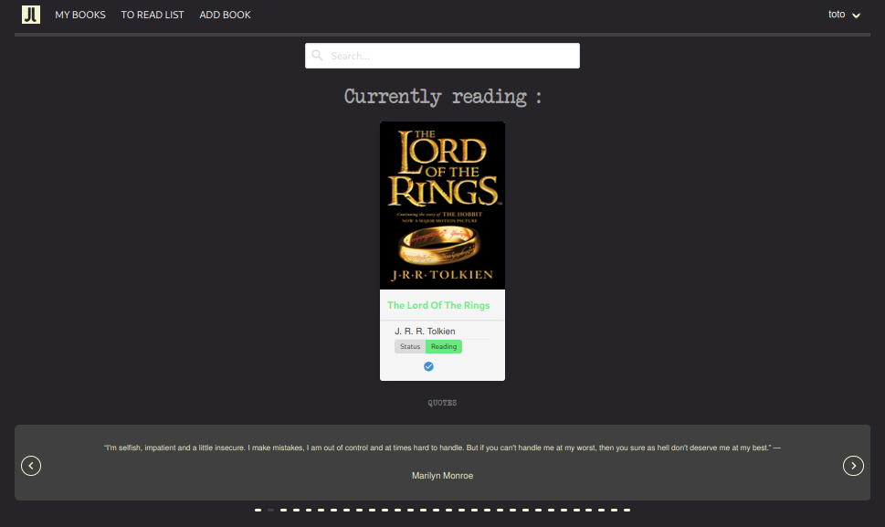
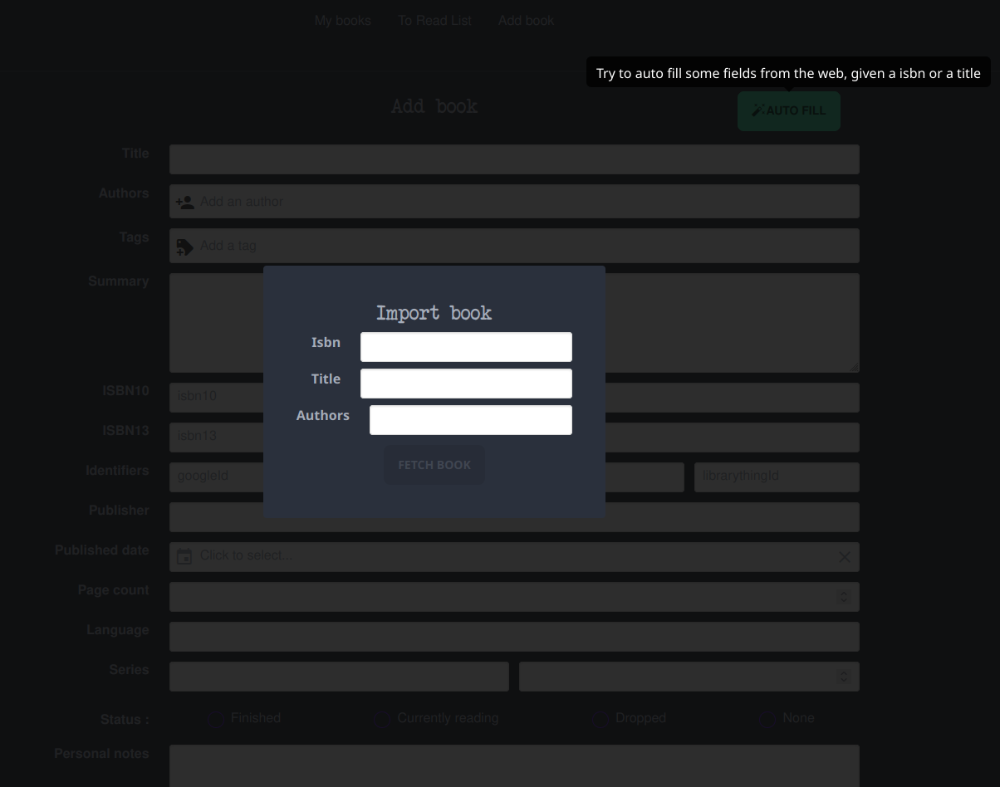
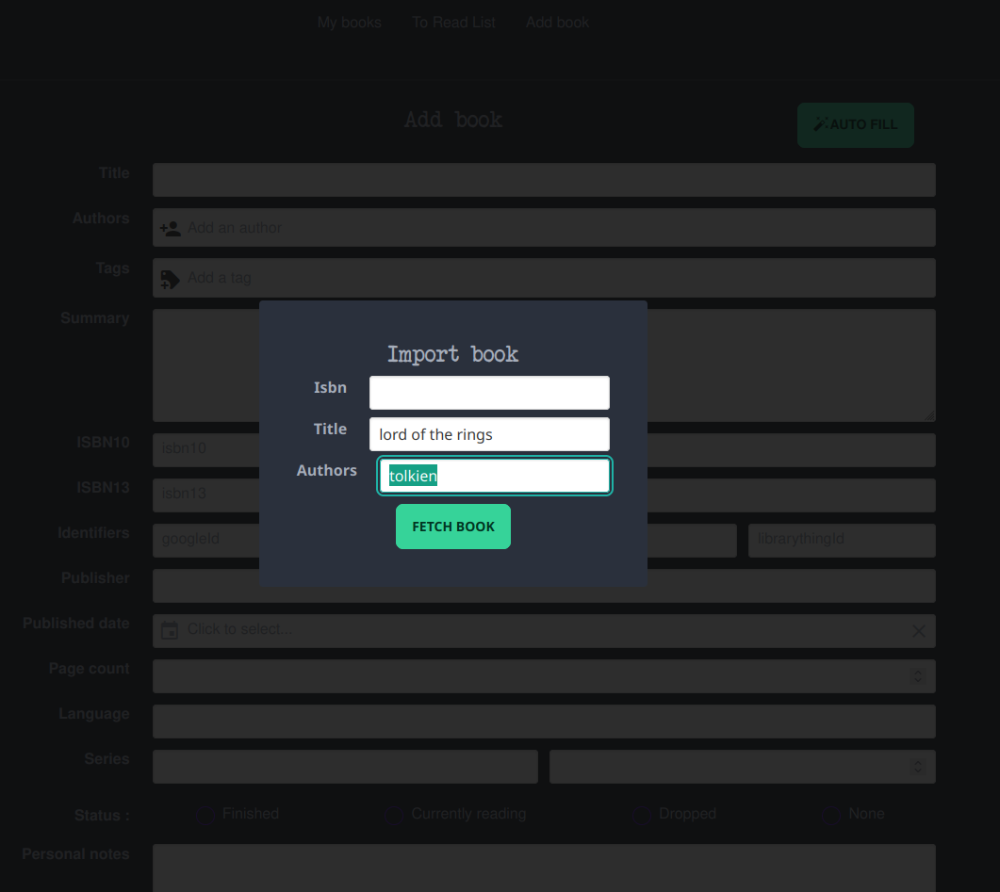
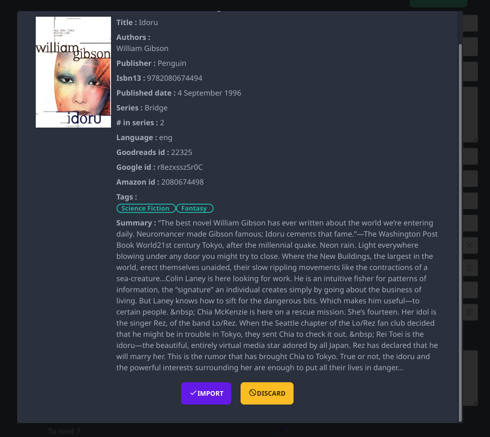
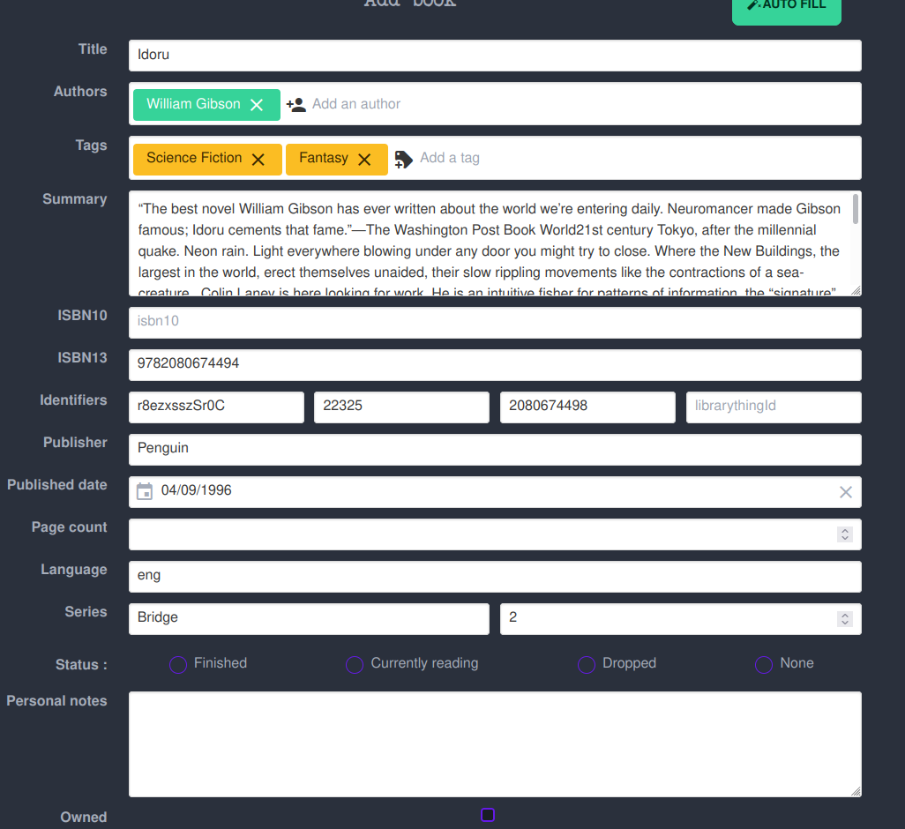
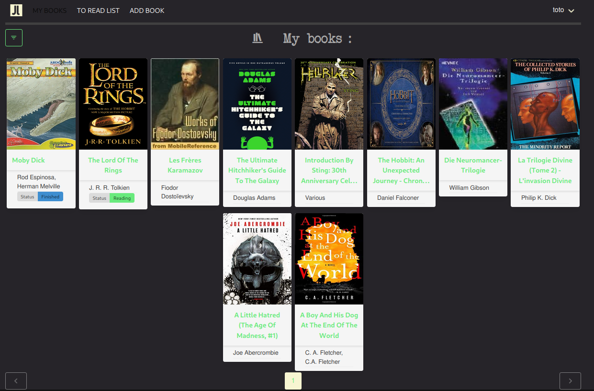
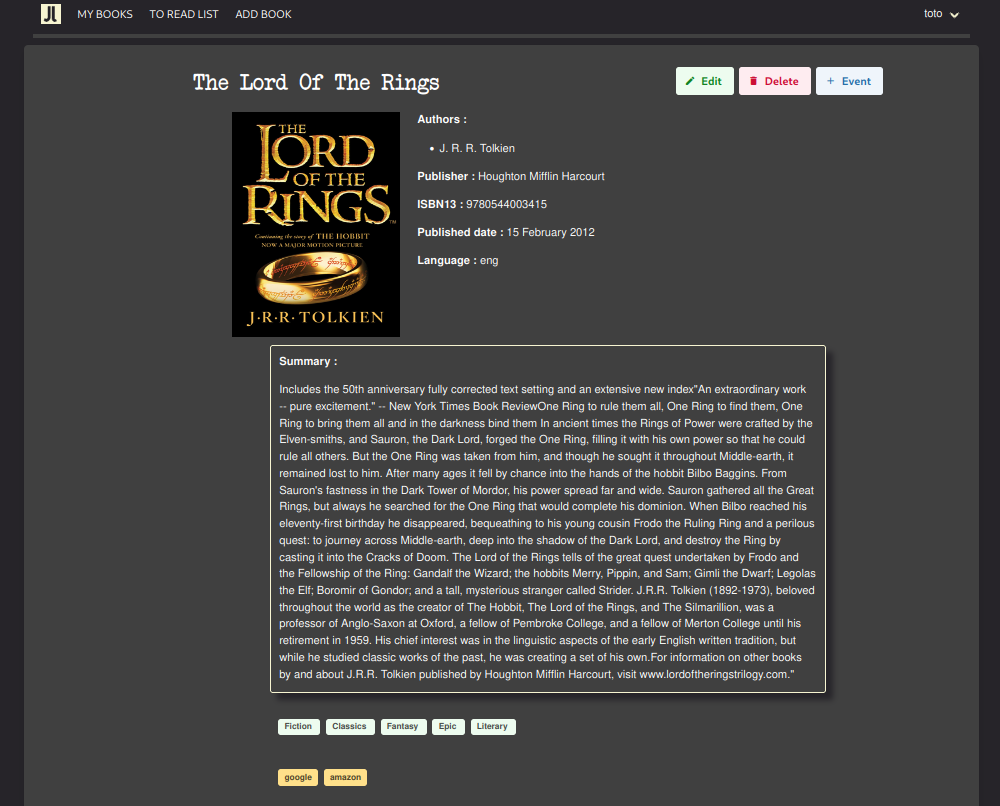
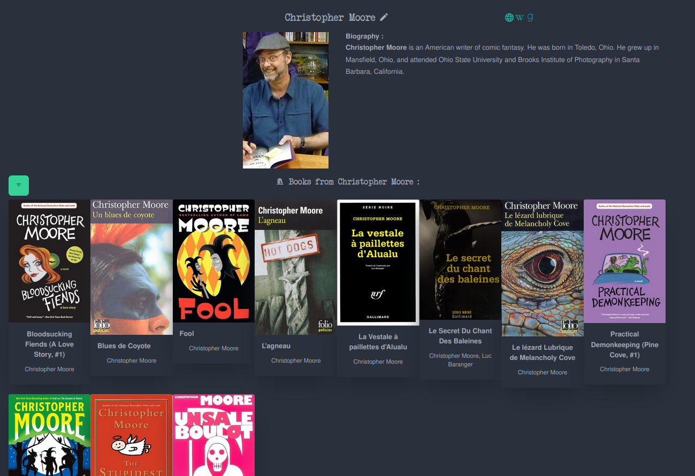
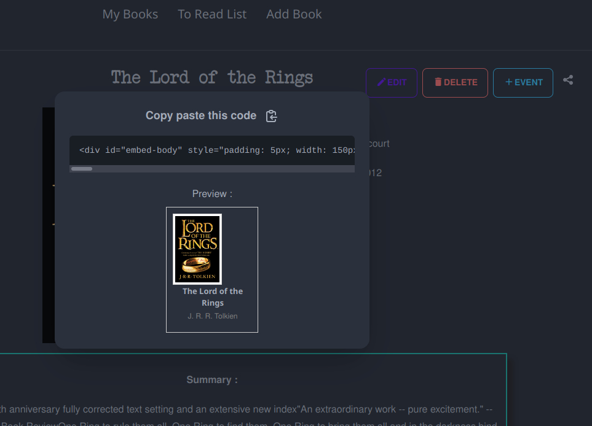
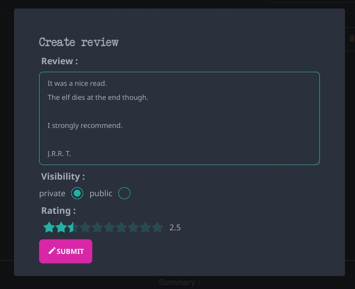

# JELU

    [](https://discord.gg/3RZJ4zuMP5) [](https://crowdin.com/project/jelu)

There is a matrix channel available : https://matrix.to/#/#jelu:matrix.org

Check the [Official documentation](https://bayang.github.io/jelu-web/) for more detailed information.

Like Jelu or find it useful ? Offer me a [coffee ☕](https://ko-fi.com/bayang)

## Purpose

This app main purpose is to track what you have read, what you are reading and what you want to read.

It acts as a self hosted "personal Goodreads" because I became tired of switching providers every time an online service was shut.

I also became tired of having to export and reimport my data each time with data loss in the process.

You have control on your data since Jelu offers an API you can script or integrate with any third party tool or service (which you cannot do with the vast majority of other online services).

All your data is now located into a single-file database which can be saved anywhere.

## Features

* track read books so you don't have to remember everything, and view your history (by year and month)
* manage to-read list
* Import history (from goodreads via csv export or a file with a list of ISBNs, one by line)
* Export your data in a csv file
* Import single books manually or automatically via online search (through title, authors or isbn)
* Mark books as currently reading, finished or dropped
* Books can be tagged and a tag page can display all books with that tag
* You can use tags to create custom shelves
* Links to third party providers are fetched online (google books, amazon, goodreads, librarythings) or computed from those providers id you could enter manually.
* Author page with author detail and books from this author
* Auto import author details from wikipedia
* Auto merge authors (to fix duplicates resulting from automatic imports for example)
* Provide embed code snippets so that books can be tracked in other sites, blogs or even markdown notes/journal
* Provide some stats about your readings
* Multi user support (ldap login, proxy authentication, see other user libraries)
* provides an API
* Write reviews and share them, see the reviews of other users on your instance
* Fallback metadata providers (see [official doc](https://bayang.github.io/jelu-web/configuration/) for configuration)
* Metadata import from epub or opf files
* Isbn scanning via camera on mobile

## Usage

* Import your existing history if you have a Goodreads account
* Start recording your read books
* Add books you want to read
* Edit tags, books, import and change covers (either from a file on disk or from a url) ...

## Installation

### Java

* download the java Jar from the releases section in a dedicated folder
* go to this folder
* start the jar (it is a spring fat jar so dependencies are included) : eg `java -jar jelu-0.13.0.jar`
* If you want to tweak the default config (see `src/main/resources/application.yml`), just create a yaml file called application.yml in the same folder as the jar.

For example if you want the database to be located next to the jar file (instead of being located in the default `${user.home}/.jelu/database/` folder) :

```yaml
jelu:
  database:
    path: .
```

The automatic metadata online search is provided for the moment through a calibre tool called fetch-ebook-metadata (whether you like it or not).

So if you want to use it with the java install, provide the path to the executable in the config, like so :

```yaml
jelu:
  metadata:
    calibre:
      path: /usr/bin/fetch-ebook-metadata
```

If you run into a cors issue, update the config with the desired origins like so :

```yaml
jelu:
  cors.allowed-origins:
    - https://jelu.myserver.org
```

Then open the web UI in your web browser at `localhost:11111`

Concerning Cors, the default is to accept everything, which you might not not want to do.

No config in the config file is equivalent to :

```yaml
jelu:
  cors.allowed-origins:
    - "*"
```

### Docker

An image is available here :

https://hub.docker.com/repository/docker/wabayang/jelu

This one is the easiest if you are used to it.

The docker image we provide embeds the fetch-ebook-metadata executable to automatically import books based on their title, authors or isbn.

A sample docker compose would look like that :

```yaml
version: '3.3'
services:
  jelu:
    image: wabayang/jelu
    container_name: jelu
    volumes:
      - ~/jelu/config:/config
      - ~/jelu/database:/database
      - ~/jelu/files/images:/files/images
      - ~/jelu/files/imports:/files/imports
      - /etc/timezone:/etc/timezone:ro
    ports:
      - 11111:11111
    restart: unless-stopped

```

!!!! WARNING : ARM versions must add this environment variable for automatic metadata fetching :
`JELU_METADATA_CALIBRE_PATH=/usr/bin/fetch-ebook-metadata`

### Kubernetes (Helm)

An unofficial Helm-Chart to deploy Jelu to Kubernetes is available here:

https://artifacthub.io/packages/helm/tibuntu/jelu

## Screenshots

Home page :



Auto import form (empty) :



Auto import form (filled) :



Auto import form (result preview) :



Auto import form (edit pre-filled results before importing to your account, eg : modify tags etc...) :



Books list :



Book detail page :



Book detail, events part :


Author page :



Embed code and preview :



Review creation :




## Translations

You can help with translations : everything is hosted on crowdin https://crowdin.com/project/jelu

## Contributions :

* Czech translation : @filcuk, @ondrejk
* Danish translation : @SirBogner
* German translation : @puckzuck
* Polish translation: @Sebastian Jasiński (PrinceNorris)
* Italian translation : @AleCornella

(if you should be here or want your name modified just contact me)
